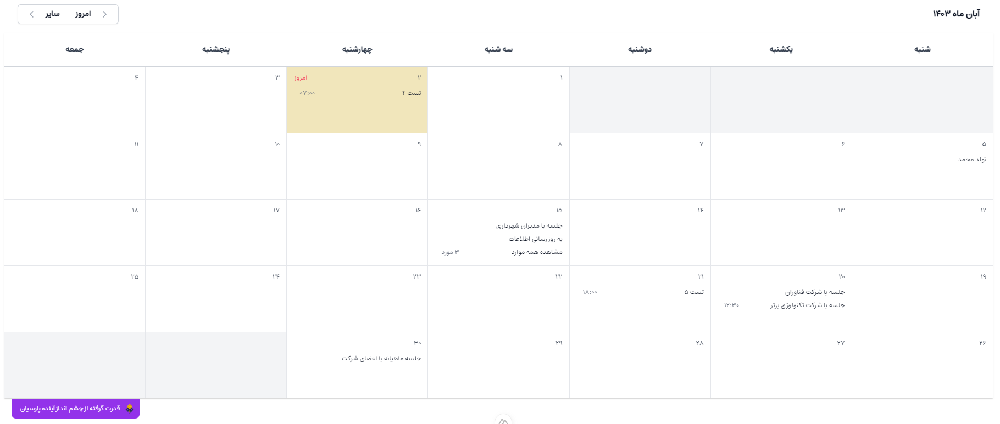

# Cap-Jalali-Calendar

`Cap Jalali Calendar` is a Jalali Calendar component library for [**Nuxt 3 FrameWork**](https://nuxt.com/).

## About

The `Cap Jalali Calendar` is an open-source library developed and maintained by [**CAP Company**](https://i-cap.ir). It is developed using `Nuxt 3` framework and `tailwindcss`.

## Showcase

<p align="center"></p>


## Quick Setup

1. Add `Cap-Jalali-Calendar` dependency to your project .

### Using yarn :

```bash
yarn add Cap-Jalali-Calendar
```

### Using npm :

```bash
npm install Cap-Jalali-Calendar
```

### Using pnpm :

```bash
pnpm install Cap-Jalali-Calendar
```

1. Add `cap-jalali-calendar-nuxt3` to the `modules` of `nuxt.config.ts`


```js
export default defineNuxtConfig({
  modules: ['cap-jalali-calendar-nuxt3']
});
```

That's it! You can now use library in your Nuxt app ✨


## How to Use

Using the calendar is easy, you just need to import the library and use it as follows.

```js
<JalaliCalendar />
```


## Props
| **Key**                                 | **Type**  | **Default** | **Description**                                                    | sample                   |
|-----------------------------------------|-----------|-------------|--------------------------------------------------------------------|--------------------------|
| `cellClass`                             | `string`  | empty       | you can add custom class for calendar days                         | bg-rose-400 p-5          |
| `cellTodayClass`                        | `string`  | empty       | you can change class of today calendar cell                        | bg-purple-500 text-white |
| `showMonthSelector`                     | `boolean` | false       | if set TRUE , can access change month button on header of calendar |                          |
| `events`                                | `array`   | null        | list of calendar events based on template                          |                          |


## How To Using Classes

Using the calendar is easy, you just need to import the library and use it as follows.

```vue
<JalaliCalendar 
  cellClass="!text-white !bg-purple-500"
  cellTodayClass="!text-slate-500 !bg-gray-100" />
```


## Event Model

First of all, you need to add the interface and enum related to the events format. 

```js
interface DayEvent {
  id: number,
  title: string,
  color: string,
  time: string,
  date: string,
  extra?:any,
  action: EventActions,
}

enum EventActions {
  NONE= 0,
  GOTO_URL= 1,
  ALERT= 2
}
```

Then it is recommended to create a list to store the events, in the example below we have also filled this list with 2 items.
```js
const _events = ref<DayEvent[]>([
  {
    id: 1,
    title: 'رویداد اول',
    color: 'red',
    time: '12:45',
    date: '1403/07/23',
    action: EventActions.NONE,
  },
  {
    id: 2,
    title: 'رویداد دوم',
    color: 'blue',
    time: '17:23',
    date: '1403/07/23',
    action: EventActions.NONE,
  }
])
```
In the next step, we used a computed method to optimize and manage events
```js
const events = computed<DayEvent[]>(() =>{
  return _events.value;
})
```
Finally, we connected the prepared list to the calendar as follows. 
Also, after connecting the list of events to the calendar, you can still add to that list of events and view them in the calendar at the same time without needing to make any changes.
```vue
    <JalaliCalendar :events="events" />
```


## Templates
You can customize the calendar using templates. It is now possible to customize to change events and add button(s) to the top bar of the calendar.

| **Key**                                 | **Description**                                                    |
|-----------------------------------------|--------------------------------------------------------------------|
| `customButton`                             | It is used to add a button to the top bar of the calendar                         |
| `event`                        | Use this template to personalize events                        |

## How To Using Template : customButton

```vue
<!--#region Use Template : Custom Button On Header -->
<JalaliCalendar :events="events">
    <template #customButton> 
        <button type="button"> مشاهده بیشتر </button>
    </template>
</JalaliCalendar>
<!--#endregion-->
```

## How To Using Template : customButton
```vue
<!--#region Use Template : Custom Event -->
    <JalaliCalendar :events="events">
      <template #event="{ event }">
         <a href="javascript:" class="flex rounded-lg p-2 bg-rose-400 text-white">
           <p class="custom-title">{{ event.name }} (سفارشی شده)</p>
         </a>
    </template>
  </JalaliCalendar>
<!--#endregion-->

```


## Events
You can customize the calendar using templates. It is now possible to customize to change events and add button(s) to the top bar of the calendar.

| **Key**                                 | **Description**                                                    |
|-----------------------------------------|--------------------------------------------------------------------|
| `onChangeMonth`                          | This event occurs when the time period of the calendar display changes, use this event to receive the start and end time period of the calendar.                         |
| `onEvent`                        | This event will be called when an event is clicked on the calendar days.                        |


## Full Sample Code

```vue
    <JalaliCalendar
  :events="events"
  cellClass=""
  cellTodayClass=""
  :showMonthSelector="true"
  @onChangeMonth="onChangeMonthListener"
  @onEvent="eventClickListener">
  <!--#region Use Template : Custom Button On Header -->
  <template #customButton>
    <button type="button"> کلیک کنید </button>
  </template>
  <!--#endregion-->
  <!--#region Use Template : Custom Event -->
  <template #event="{ event }">
    <a href="javascript:" class="flex rounded-lg p-2 bg-rose-400 text-white">
      <p class="custom-title">{{ event.title }} (سفارشی شده)</p>
    </a>
  </template>
  <!--#endregion-->
</JalaliCalendar>
```


## Thank You
Thanks to all colleagues of [CAP Company](https://i-cap.ir)

Author : [Ahmad Ghanavati](mailto:ahmad_ghanavati.ir)

#### Thank you Learning Site Source :
https://canopas.com/how-to-create-and-publish-nuxt-component-library-2f9e60278407
